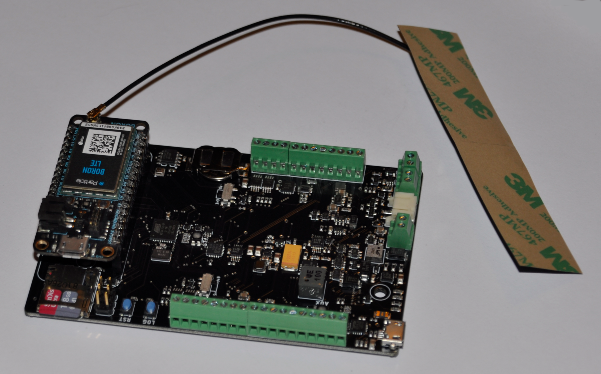
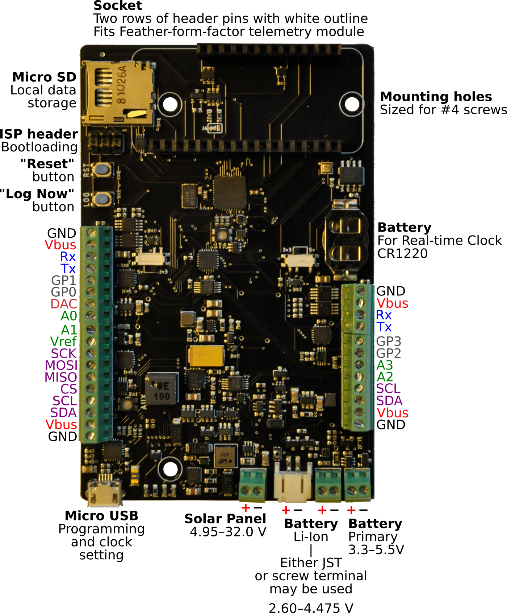
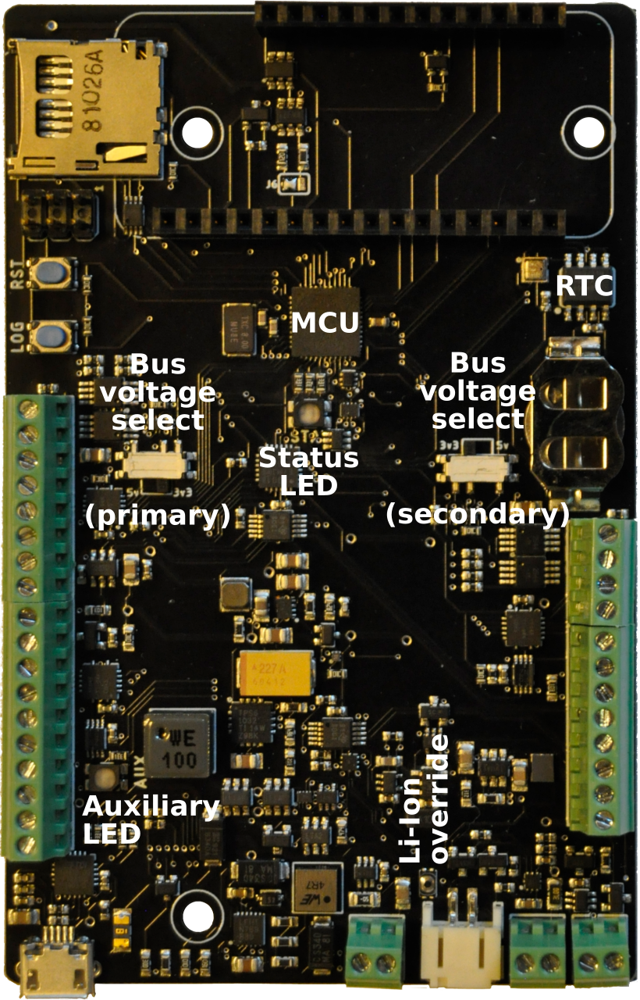

# Okapi: Data logger with integrated solar charging and modular telemetry



***Okapi data logger, with a micro-SD card for local storage and a Particle Boron telemetry module.***

The **Okapi** data logger responds to the need for a robust, flexible, and power-efficient open-source option to record and transmit data from remote locations. It is programmable using the open-source standard Arduino framework via a standard micro-USB cable and supports a wide range of sensor input/output options. It connects to dual power supplies to ensure consistent recordings, and interfaces with a range of “Feather”-form-factor boards for telemetry.

## Namesake

The Okapi, a relative of the giraffe, communicates over long distances using [infrasound](https://en.wikipedia.org/wiki/Infrasound). The telemetry capabilities of this data logger inspired this namesake.


## Technical specifications

### Electronic Hardware

* Microcontroller (computer) core
  * ATMega1284p
  * Arduino compatible
  * Programmable using C++
  * 8 MHz
* Real-time clock
  * DS3231M
  * Temperature-compensated crystal for high accuracy (±5 ppm)
* Sensor and general-purpose connections
  * Primary Rail (selectable 3.3V or 5V)
    * I2C (up to 128 sensors permitted; expansion ports provided by Project Heptapod)
    * SPI
    * 2x 16-bit analog
    * Analog voltage reference
    * 12-bit Digital-to-analog conversion
    * 2x General-purpose input/output
    * USART
    * 2x Vbus (selectable 3.3V or 5V)
    * 2x Ground
  * Secondary Rail (selectable 3.3V or 5V)
    * I2C (up to 128 sensors permitted; expansion ports provided by Project Heptapod)
    * 2x 16-bit analog
    * 2x General-purpose input/output
    * USART
    * 2x Vbus (selectable 3.3V or 5V)
    * 2x Ground
* Data storage and return
  * Local storage: micro SD card
  * Telemetry: support for Feather-profile boards, including Particle devices:
    * Mobile phone networks
    * WiFi
    * Bluetooth
    * [In development] Iridium satellite
* Power
  * Dual power supply
  * Primary Power
    * Built-in maximum-power-point-tracking solar-charge-control circuitry
    * Lithium-Ion battery
  * Backup Power
    * Alkaline AA batteries
  * Real-time clock
    * Coin cell
  * Power consumption
    * Primary power, sleeping: 80 μA
    * Backup power, sleeping: 4 μA
    * Active (typical: data logger without sensors): 10 mA
    * Transmitting (mobile networks, typical: Particle Boron):
      * 16 mA background
      * 40 mA burst
  * Power generation
  * Solar, low light: 100 mA
* User interface
  * “Log” button: instantaneous reading (for testing)
  * “Reset” button
  * 2x 3-color indicator LEDs
  * Computer readout via a serial monitor, included in the Arduino software
* Open-source licensing via CC BY-SA 4.0

>> @bschulz1701: Any updates needed? I think that there is also a WDT (correct?)

### Electronic Software and Firmware

* Programmable using the Arduino IDE https://www.arduino.cc/en/main/software
* Custom bootloader and board definition for ATMega1284p available via https://github.com/NorthernWidget/Arduino_Boards
* Custom libraries from Northern Widget and the open-source community
  * Primary data-logger functions
  * Libraries available with each sensor, exposing a standard interface
* Open-source licensing via GNU GPL 3.0

### Pinout and board interfaces



***Data logger with pins, connectors, and interactive items annotated.***

**Pins are colored following this convention:**
* Ground: black
* Power supply: red
* Universal Serial Asynchronous Receiver--Transmitter (USART or UART): blue
* General-purpose I/O pins: gray
* Analog inputs and associated reference voltage: green
* Digital communications buses (SPI and I2C): purple
* Analog adjustable voltage output: salmon

**The power and programming connectors at the "south" end of the board are as follows:**
* Micro-USB connector
  * The same connector as many Android and other mobile phones at the time of writing; may be programmed using any USB cable for these that is not charging-only (i.e. that can carry data)
  * Can be used with our [clock-setting program](https://github.com/NorthernWidget/SetTime_GUI) to set the time on the real-time clock.
  * Provides power to the data logger while it is connected; this power source is isolated from the batteries and solar panel, and therefore may be plugged in safely at any time.
* Solar panel, 4.95--32.0 V. A wide range of panels can work with this.
* Li-Ion battery, 2.60--4.475 V. This works with standard 18650 Li-ion batteries. It can work well with just a single battery, but if more storage is required, multiple 18650 batteries may be connected in parallel; we have a circuit-board design to do this: https://github.com/NorthernWidget/LiIon-18650-Parallel. ***CAUTION***: most commercially available multiple-18650-battery holders connect them in parallel; this voltage is ***TOO HIGH*** for the data logger.
* Primary batteries. This is ideally a pack of 3 primary (i.e., not reusable) Alkaline (or better) AA batteries with a long shelf life. The Okapi data logger will switch to these if its rechargeable power supply shuts down. The internal electronics reduce the quiescent power consumption while under backup power (see the above list of [electronic hardware technical specifications](#electronic-hardware)) and inform the logger about which power supply is being used, allowing it to, for example, reduce or temporarily terminate data transmission.

>> @bschulz1701: Solar panel supply current / size?

**"RST" and "LOG" buttons:**
* Reset ("RST"): stop the program that is currently executing on the main logger and return it to its boot sequence.
* Log Now ("LOG"): take a reading immediately. This is useful for diagnoses and testing.

>> General note: we may want to have an LED flash whenever the logger takes a reading -- even for 1/10 of a second. With an option to disable this, of course. But it is often better to know while in the field that a system is working

**Other notes, clockwise from the top:**
* The socket holds a [Feather-form-factor board](https://learn.adafruit.com/adafruit-feather/feather-specification).
  * This standard, designed by [Adafruit](https://www.adafruit.com/), has been widely adopted, including by the IoT/telemetry module designer [Particle](https://www.particle.io/).
  * We often use a [Particle Boron mobile-phone telemetry unit](https://docs.particle.io/boron/).
* Mounting holes for [\#4 screws](https://www.mcmaster.com/91772A106/)
* CR1220 battery; can power the real-time clock for up to 7 years
* ISP header (also called an ICSP header): This 3x2 header is used with an in-system programmer (in-circuit system programmer) to upload the (bootloader)[#installing-the-bootloader] to the data logger.
* A micro-SD card holds a copy of all data, whether or not any telemetry is used

>> @bschulz1701: check my clock 7-year figure



***Data logger with key microchips, LEDs, and switches marked.*** *MCU: Microcontroller. RTC: Real-time clock. LED: Light-emitting diode. Bus: a subsystem for connections and data transfer.*

The Okapi data logger contains two buses (see above), each of which has an independent voltage. The primary bus is on the left and the secondary bus is on the right. These can be selected as 3.3V (switches slid towards the inside of the board) or 5V (switches towards the outside of the board).

>> @bschulz1701: How much power can each bus source/sink?

Two LEDs, status and auxiliary, flash messages to the user to provide information on proper operations vs. a variety of possible errors. These are useful for field diagnoses, and are further described in [the field guide section, below](#field-guide).

>> Design note: move STAT label to left of LED so it can be better seen

The Li-ion override button, which can be pressed with the tip of a pen or other small object, ...

>> @bschulz1701: This somehow overrides the Li-Ion battery electronics to allow something to happen... but I am not remembering what!

## Assembly

Assembling this data logger is possible by hand with sufficient skill and the following tools:
* Temperature-controlled soldering iron
* Hot-air rework station
* Equipment for stenciling with solder paste
* ESD-safe tweezers and workstation
* Solder wick

Mechanized assembly by a professional circuit-board assembly house, which is available in many parts of the world, may be preferred due to the complexity of this data logger board.

>> THOUGHT: I have basic instructions for assembly on the [Project Walrus](https://github.com/NorthernWidget-Skunkworks/Project-TPDH-Walrus) README; I will not reproduce these here just yet, as we might want to set up a separate assembly guide, mostly with good links to existing resources, since our writing something of this nature would be to reinvent the wheel.

## Programming

### Downloading and installing the Arduino IDE

Go to https://www.arduino.cc/en/main/software. Choose the proper IDE version for your computer. For Windows, we suggest the non-app version to have more control over Arduino; this might change in the future. You will have to add custom libraries, so the web version will not work (at least, as of the time of writing). Download and install the Arduino IDE. Open it to begin the next steps.

### Installing the bootloader

Before a data logger can receive programs via the convenient USB port, it must have a *bootloader* that tells it to expect to receive new programs that way.  You can read more about bootloaders in general here: https://www.arduino.cc/en/Hacking/Bootloader.

Because you can't upload the bootloader via USB, you use the 2x3-pin 6-pin ICSP (also called ISP) header with a special device called an "in-circuit system programmer" (or just "in-system programmer; yup, that's what the acronym stands for).

Many devices exist to upload a bootloader including:
* The official [AVR ISP mkII](http://ww1.microchip.com/downloads/en/DeviceDoc/Atmel-42093-AVR-ISP-mkII_UserGuide.pdf) (no longer produced but available used)
* Using an [Arduino as an ISP](https://www.arduino.cc/en/tutorial/arduinoISP)
* The versatile [Olimex AVR-ISP-MK2](https://www.olimex.com/Products/AVR/Programmers/AVR-ISP-MK2/open-source-hardware)
* The [Adafruit USBtinyISP](https://www.adafruit.com/product/46)

To upload the bootloader, do the following:

1. Open the Arduino IDE. If you have not yet installed the Northern Widget board definitions, find and install them here (instructions provided): https://github.com/NorthernWidget/Arduino_Boards
2. Select the desired board -- most likely ***ATMega1284p 8MHz*** under *Northern Widget Boards*.
3. Plug the data logger into your computer via a micro-USB cable to provide power.
4. Plug your ISP of choice into your computer (via a USB cable) and onto the 6-pin header. There are two ways to place it on; the header is aligned such that the ribbon cable should be facing away from the board while programming. If this fails without being able to upload, try flipping the header around.
5. Go to Tools --> Programmer and select the appropriate programmer based on what you are using.
6. Go to Tools --> Burn bootloader. Typically, within a few seconds, you learn whether you succeeded or failed. Hopefully it worked!

***Important note for Linux users:*** You must supply permissions to the Arduino IDE for it to be able to use the ICSP, or you will have to run it using `sudo`. The former option is better; the latter is easier in the moment.

### Installing the requisite software libraries

>> @awickert: Add a full list of the requisite software to install; finish the firmware aggregator and use those directions (or the Arduino ones) to help users install that + sdfat. Include screenshots and host those directions at https://github.com/NorthernWidget-Skunkworks/Firmware-Aggregator.

### How to write a program

The below program is an example that you can copy and paste directly into the Arduino IDE in order to upload to your data logger. We'll walk you through what each piece of the code is and does.

#### Full program
```c++
/*
 * Resnik example: connected with a Walrus pressure--temperature sensor, often
 * used for water-level measurements, via the Longbow I2C/RS-485 translator.
 * Written by Bobby Schulz with a few comments added by Andy Wickert.
 */

#include "Okapi.h"
#include <TP_Downhole_Longbow.h>

TP_Downhole_Longbow Walrus; // Instantiate Walrus sensor; relict library name
Okapi Logger; // Instantiate data logger object

String Header = ""; // Information header; starts as an empty string
uint8_t I2CVals[1] = {0x22}; // I2C addresses of sensors

unsigned long UpdateRate = 60; // Number of seconds between readings

void setup() {
  Header = Header + Walrus.GetHeader();
  Logger.begin(I2CVals, sizeof(I2CVals), Header); // Pass header info to logger
  Init();
}

void loop() {
  Logger.Run(Update, UpdateRate);
}

String Update()
{
  Init();
  delay(1500);
  return Walrus.GetString();
}

void Init()
{
  Walrus.begin(13, 0x22); // Instantiate Walrus (at address = 13)
                          // and Longbow Widget (at address = 0x22)
}
```

#### "Include" statements

```c++
#include "Okapi.h"
#include <TP_Downhole_Longbow.h>
```

These bring in the two code libraries involved, the former for the data logger and the latter for the sensors. This allows the user to access the classes and functions within these two libraries, as we will show in more detail below.

#### Instantiate a sensor object

```c++
TP_Downhole_Longbow Walrus; // Instantiate Walrus sensor; relict library name
Okapi Logger; // Instantiate data logger object
```

"Instantiating an object" means that we create our own specific versions of the a class of items. This can be thought of as: `Breakfast myBreakfast`. Breakfast is the general concept, but I create "myBreakfast", which I can then modify. In this same way, "Logger" is what we call our Okapi data logger, and "Walrus" is what we call our "TP_Downhole_Longbow" sensor; this name is a holdover from an earlier design that is the ancestor of the Walrus. We can then access functions and variables within these two instantiated objects.

#### Declare the header string

```c++
String Header = ""; // Information header; starts as an empty string
```

We start with an empty header, but will soon add information to it.

#### Create a list of the I2C addresses of the sensors

```c++
uint8_t I2CVals[1] = {0x22}; // I2C addresses of sensors
```

This is the trickiest step. You need to know what the I2C address of your sensor is. You can skip this, but then the logger will not run a check to see if the sensor is properly connected.

>> Let's make sure that we record this one each page, or find a way to replace this.

#### Declare the amount of time between logging events

```c++
unsigned long UpdateRate = 60; // Number of seconds between readings
```

This is the number of seconds between logging events. If it takes 2 seconds to record data, make sure that you give the logger at least 3 seconds between events. The maximum logging time is set by the watchdog timer, which [FINISH HERE]

>> @BSCHULZ1701: Is there an external WDT on Okapi?

#### `setup()` step: runs once at the start

```c++
void setup() {
  Header = Header + Walrus.GetHeader();
  Logger.begin(I2CVals, sizeof(I2CVals), Header); //Pass header info to logger
  Init();
}
```

`setup()` is a special function that runs just once when the logger boots up. In this case, it first adds the Walrus' header to the header string. `GetHeader()` is a standard function that lies within each of our sensor libraries and returns this header information as a `String`. We then pass the header and the I2C values to the Okapi library's `begin()` function. This sets up the header and prepares the data loger to record data. Finally, this function calls `Init()`, which we skip ahead to describe immediately below.

>> (awickert): I still don't understand why we have to pass `sizeof()` and can't just compute that within the function.

#### `Init()` function: skipping ahead to understand `setup()`

```c++
void Init()
{
  Walrus.begin(13, 0x22); // Instantiate Walrus (at address = 13)
                          // and Longbow Widget (at address = 0x22)
}
```

The `Init()` function calls the `begin()` function, standard within each Northern Widget sensor library, to instantiate the connection ports (e.g., I2C, RS-485) used to communicate between the sensor and the logger. In this case, there is only one sensor, but two ports are needed: An RS-485 signal goes from the Walrus to the Longbow Widget, which then converts the signal into an I2C signal with its own address. The reason for this is that an I2C signal can travel only ~3 m, but an RS-485 signal can travel ~100 m.

#### `loop()` step: keeps running until stopped

```c++
void loop() {
  Logger.Run(Update, UpdateRate);
}
```

The loop calls the main function of the Okapi library, `Run()`, repeatedly. This puts the logger into a low-power sleep mode and wakes it up only when interrupted by the clock or the "LOG" button. `Update` refers to the function described immediately below. `UpdateRate` is our logging interval defined above.

#### `Update()` function: Gives data for the logger to record

```c++
String Update()
{
  Init();
  delay(1500);
  return Walrus.GetString();
}
```

The `Update()` function first calls the `Init()` function to be sure that the sensor is ready to log. It then in this case delays 1500 milliseconds; this is an ad-hoc solution to the question of how long it takes the pressure transducer to settle after being started up, and is a safe large amount of time. This function then can `return` a string of all of the Walrus' readings (one pressure and two temperature measurements) separated by commas. This is then concatenated to a list of logger-internal measurements -- date/time; on-board temperature, pressure, and relative humidity; and onboard voltages for battery and solar-panel status -- and recorded to the SD card. If telemetry were present, these data could also be sent to a remote location.

### Reference

A full index of the public variables and functions within the Okapi data logger library is available at https://github.com/NorthernWidget/Okapi_Library.

>> Send user to library page

>> Thoughts: We should make all comments compatible with doxygen (following) what I did with the ALog library. It also looks like TravisCI has support for Arduino(!) This means that we could also automate construction of the documentation for these libraries.

### Integration with Particle Boron

>> @bschulz1701?

## Wiring

>> Example needed

## Power supply

* **Lithium-ion 18650 rechargeable batteries**; this board can hold two in parallel: https://github.com/NorthernWidget/LiIon-18650-Parallel
* **Solar panel**. A wide range is acceptable, but we like [Voltaic Systems' 6-watt panel](https://voltaicsystems.com/6-watt-panel/). If you do not want to snip off the barrel jack, [this extension plug from Adafruit should work](https://www.adafruit.com/product/2788) (though we have not tested it... and you'll also have to cut *it* in half).
* **Primary alkaline batteries**; we typically use three high-quality (e.g., Duracell) AAs. These are the backup power supply, and we place them in a [3xAA holder (in series for the proper voltage) with a switch](https://www.jameco.com/z/SBH-331-AS-R-3x-AA-Battery-Holder-with-Cover-and-Switch_216144.html).

>> @bschulz1701: new smarter 18650 holder?

## Housing

The below suggestions encompass what we use and suggest for the housing. In the end, any sufficiently waterproof enclosure will work.

### Materials

* **Enclosure**: [PolyCase WH-16-03 outdoor-rated hinged enclosure](https://www.polycase.com/wh-16)
* **Cable glands**: [RDC07AA](https://www.elecdirect.com/catalogsearch/result/?q=RDC07AA). One per sensor, plus one for the solar panel.
>> AW: Photo didn't take; look up
* **Fasteners**
  * [M5-0.8 x 10 mm truss head screws](https://www.mcmaster.com/92467A320/) x4 to attach mounting plate to threaded inserts in the enclosure
  * [\#4-40 x 1/4 in pan head screws](https://www.mcmaster.com/91772A106/) x22 to attach Okapi, battery packs, and mounting plate to standoffs
  * [\#4-40 x 2 in Female Threaded Hex Standoffs](https://www.mcmaster.com/91115A173/) x3 to stand off Okapi from mounting plate
  * [\#4-40 x 1/2 in Female Threaded Hex Standoffs](https://www.mcmaster.com/91920A533/) x8 to stand off AA battery pack and Li-Ion battery pack from mounting plate
* **Mounting plate for Okapi** (Milled, ABS)
  * [Mounting Plate Design](Mounting%20Plate)
* **Power**
>> Solar panel
  * [3x AA battery pack BK-1280-PC6](https://www.digikey.com/en/products/detail/mpd-memory-protection-devices/BK-1280-PC6/1640076) for alkaline battery backup, mounting holes included for #4-40 screws
>> Li-Ion battery and holder

### Tools

* CNC mill and/or drill press
* Deburring tool or knife + skill and patience
* Torque wrench(es) for 1.0, 1.2 N m

### Assembly

>> Guide with photos. Perhaps ask @superchap123 to use his CNC

>> Placeholder for Now

>> Also include information on passing wiring through

## Field operator's guide

### Initialize
1. Ensure that all connections are secure and SD card is inserted
2. Turn battery pack on
3. Wait for GREEN - GREEN - 5x Blue Flash.
	- If you see this, the logger is properly recording data. To double-check, go to "Check".
	- If you see a different flash pattern, go to "Error".

### Check
1. After going through "Initialize", wait 2-3 minutes.
2. Follow the instructions in the "Download" section
3. Check to make sure that all the data are being recorded at the proper (UTC) time.
4. Check that valid values are being recorded for sensors.
7. Whether or not files are properly recorded, return to "Initialize"
	- If files are not recorded, replace the SD card, check all connections, turn the logger back
	  on, and try again
	- If there is an issue with a specific sensor, check connections and troubleshoot
	- If files are recorded properly, return to Initilaize and do not return to "Check"

### SD card swap
1. Turn battery pack off.
2. Remove SD card. Ensure that it is labeled. Put it somewhere safe and memorable.
3. Replace the SD card with an equivalently labeled SD card.
4. Go to "Initialize"

### Download
1. Turn battery pack off.
2. Remove SD card.
3. Insert SD card in computer.
4. Navigate in the SD card to the most recent "log" file (NW→<serial_number>→Log<number>.txt).
5. Save the data file in a well-labeled and organized place.
6. Safely eject the SD card from the computer
7. Go to "Initialize"


### Error

#### Status Codes

The first LED (AUX) will turn green so long as power is applied.
The second LED (STAT) will have one of the colors below.

**Green:** All systems check out OK, logging will proceed

**Orange:** A sensor system is not registering properly, some sensor data may be missing or incorrect
* Verify correct polarity of sensor connection
* Ensure the right sensor is connected
* Verify the screw terminals are well connected to the wires (a lose connection can cause a failure)
* Make sure battery power is applied, some sensors can fail otherwise

**Cyan:** Clock time is incorrect, but logger is otherwise working correctly
* Connect the logger to a computer and reset the clock using the Northern Widget Time Set GUI
* Start Processing
* Open the Northern Widget Time Set program
* Note and record the wrong time if the logger has been out in the field, alongside the current (correct) time, to correct the prior measurements
* Click the "set time" button and check that you are <3 seconds off of the correct time.
* Click the "close" button.

**Pink** (looks like purple to some people): SD card is not inserted
* Insert the SD card, or remove and re-insert to make sure card is fully seated

**Red**: Critical on board component is not functioning correctly, such as SD card or clock. Logging will likely not be able to proceed
* Attempt power cycle
* Try different SD card
* Disconnect all sensors; reconnect one by one and check.

**Yellow, Fast Blinking**: <50% battery capacity.
* Replace batteries: turn battery pack off, replace batteries, and turn battery pack back on.

**Red, Fast Blinking**: Batteries <3.3V. Voltage too low to properly function.
* Replace batteries: turn battery pack off, replace batteries, and turn battery pack back on.

#### General tips to solve many kinds of errors
* Turn the the logger off and on
* Verify the quality of all screw terminal connections by gently tugging on the wires and making sure they stay in place, if not, remove, replace, and re-tighten the connection
* Ensure sensors and/or cables are not damaged, this can result is shorts or other problems
* Make sure batteries have sufficient voltage to run the logger (>3.3 V)

## Acknowledgments

Support for this project provided by:


<br/>
<br/>
<a rel="license" href="http://creativecommons.org/licenses/by-sa/4.0/"></a><br />This work is licensed under a <a rel="license" href="http://creativecommons.org/licenses/by-sa/4.0/">Creative Commons Attribution-ShareAlike 4.0 International License</a>.
